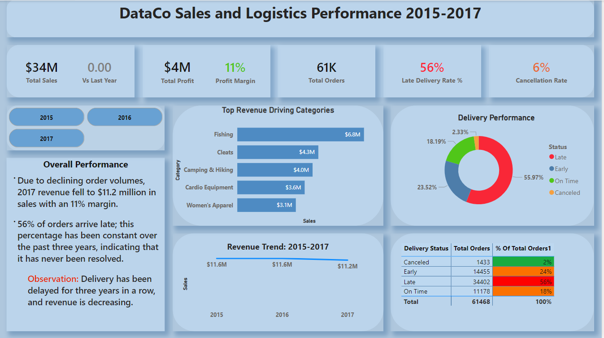
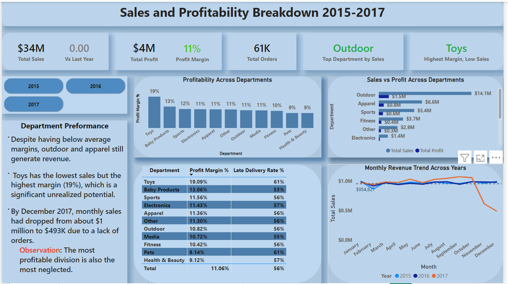
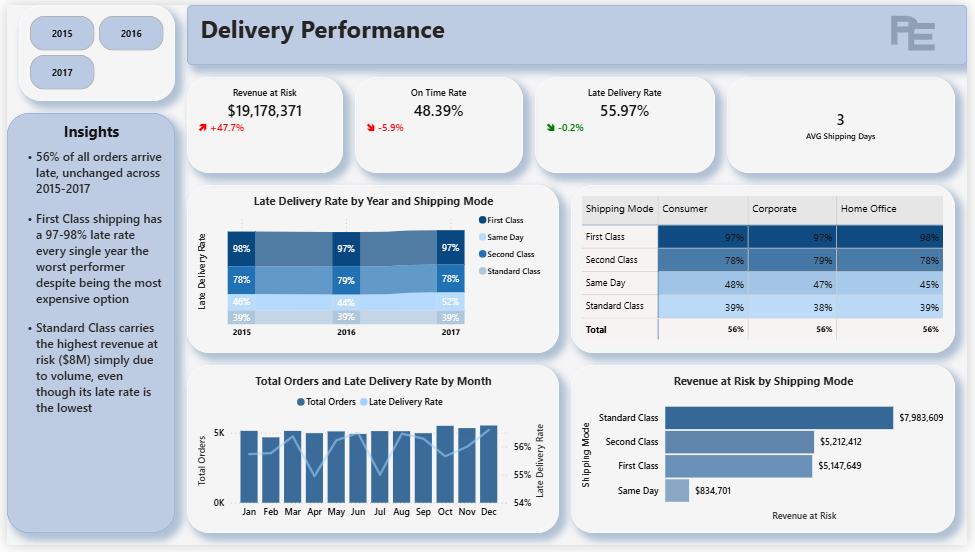
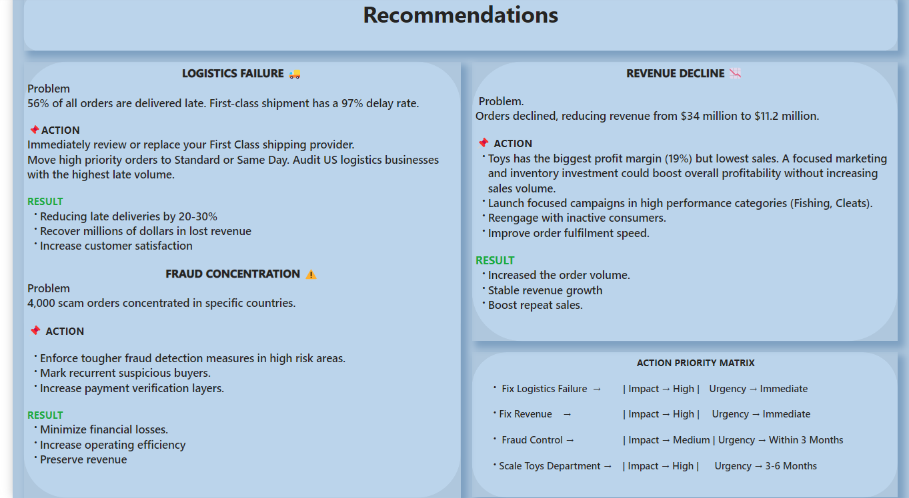
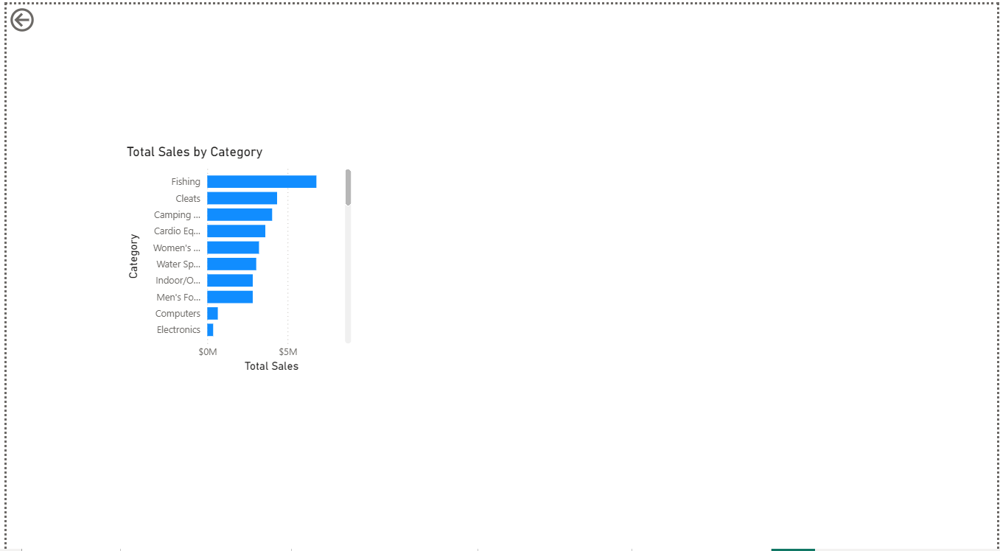

# supply-chain-analytics
Power BI dashboard analyzing 61,000+ Supply chain orders across DataCo (2015-2017). Covers sales performance, delivery operations, fraud detection and strategic recommendations.


## Project dataset
[Download Power BI File](https://drive.google.com/file/d/1OY0qGqWKcJtL6FzjESCFQ6BMX-1OtXFi/view?usp=drive_link)



---

## Project Overview

This project analyzes **61,468 supply chain orders** from DataCo Global 
across 2015–2017, uncovering critical operational failures, revenue risks, 
and fraud patterns that were costing the business millions in lost revenue 
and customer trust.

**Tool Used:** Microsoft Power BI  
**Dataset:** DataCo Supply Chain Dataset (Kaggle)  
**Records Analyzed:** 61,468 orders  
**Time Period:** 2015–2017 (2018 excluded — partial year data)  
**Dashboard Pages:** 5 pages + drill-through

---

## Business Questions Answered

1. Are late deliveries affecting revenue and profit?
2. Which departments and categories drive the most value?
3. Where is fraud concentrated and what is its financial impact?
4. Which customer segments experience the worst service?
5. What are the root causes of operational decline?

---

## Key Findings

| Metric | Value | Status |
|--------|-------|--------|
| Total Revenue (2015-2017) | $34M |  
| Revenue at Risk (Late Delivery) | $19M | Critical |
| On-Time Delivery Rate | 48% |  Critical |
| Profit Margin | 11% | Acceptable |
| Suspected Fraud Orders | 4,000 | Concerning |
| Cancellation Rate | 6% | Monitor |

---

## Dashboard Pages

### Page 1 — Overview

High-level business snapshot with KPI cards, 
top category performance, delivery breakdown 
and revenue trend across 2015–2017.

### Page 2 — Sales & Profitability

Department-level profitability analysis, 
customer segmentation, monthly trends 
and profit margin vs delivery performance comparison.

### Page 3 — Delivery & Operations

Root cause analysis of late deliveries by 
department, country and shipping mode. 
Fraud concentration analysis by market.

### Page 4 — Recommendations

Actionable business recommendations with 
Problem → Action → Result framework and 
priority matrix rated by Impact and Urgency.

### Category Detail — Drill Through

Interactive drill-through from department 
to category level performance analysis.

---

## Data Preparation & Cleaning

The following steps were performed before building the dashboard:

- Removed duplicate records
- Standardized date formats for time accuracy
- Created DateTable for accurate year/month calculations
- Grouped 40+ product categories into logical department segments
- Validated delivery status values across all records
- Removed columns irrelevant to this analysis, including customer first name, last name and 
  email address columns to reduce noise and ensure data privacy
- Standardized text formatting by removing underscores, symbols and special characters 
  across multiple columns for consistency and readability
- Converted ALL CAPS text values to Proper Case formatting 
- Excluded partial 2018 records to ensure only complete yearly data was analyzed
- Replaced abreviated texts with their full spellings
- Replaces country and city names spelt in Spanish with the English spellings using a maping table
---

## DAX Measures Created

### Sales Measures
```DAX
Total Sales = SUM(DataCoSupplyChainDataset_clean_processing[Sales])

PY Sales = VAR CurrentYear = SELECTEDVALUE(DateTable[Year])RETURN
CALCULATE([Total Sales],DateTable[Year] = CurrentYear - 1)

Sales YoY % = DIVIDE([Total Sales] - [PY Sales], [PY Sales], 0)
```

### Profit Measures
```DAX
Total Profit = SUM(DataCoSupplyChainDataset_clean_processing[Net_Profit])

Profit Margin % = DIVIDE([Total Profit], [Total Sales], 0)
```

### Order Measures
```DAX
Total Orders = COUNTROWS(DataCoSupplyChainDataset_clean_processing[Order_id)

% of Total Orders = DIVIDE(COUNTROWS(DataCoSupplyChainDataset_clean_processing),
CALCULATE(COUNTROWS(DataCoSupplyChainDataset_clean_processing),ALL(DataCoSupplyChainDataset_clean_processing)), 0)
```

### Delivery Measures
```DAX
On Time Orders = CALCULATE(COUNTROWS(DataCoSupplyChainDataset_clean_processing),
DataCoSupplyChainDataset_clean_processing[Delivery_Status] = "Shipping on time")

On Time Rate % = 
DIVIDE([On Time Orders], [Total Orders], 0)

Late Orders = CALCULATE([Total Orders],
DataCoSupplyChainDataset_clean_processing[Delivery_Status] = "Late")

Late Order Rate % = DIVIDE([Late Orders], [Total Orders], 0)

Avg Shipping Days = AVERAGE(DataCoSupplyChainDataset_clean_processing[Days for shipping (real)])

Revenue at Risk = CALCULATE([Total Sales],
DataCoSupplyChainDataset_clean_processing[Delivery_Status] = "Late")

Early Orders = CALCULATECOUNTROWS(DataCoSupplyChainDataset_clean_processing),
DataCoSupplyChainDataset_clean_processing[Delivery_Status] = "Early")
```

### Fraud & Risk Measures
```DAX
Fraud Orders = CALCULATE(COUNTROWS(DataCoSupplyChainDataset_clean_processing),
DataCoSupplyChainDataset_clean_processing[Order_Status] = "SUSPECTED_FRAUD")

Fraud Rate % = DIVIDE([Fraud Orders], [Total Orders], 0)

Revenue Lost to Fraud = CALCULATE([Total Sales],
DataCoSupplyChainDataset_clean_processing[Order_Status] = "SUSPECTED_FRAUD")
```

### Cancelled Orders Measures
```DAX
Cancelled Orders = CALCULATE(COUNTROWS(DataCoSupplyChainDataset_clean_processing),
DataCoSupplyChainDataset_clean_processing[Order_Status] = "CANCELED")

Cancellation Rate % = DIVIDE([Cancelled Orders], [Total Orders], 0)
```

### Department & Category Measures
```DAX
Best Category = FIRSTNONBLANK(TOPN(1, VALUES(DataCoSupplyChainDataset_clean_processing[Category]),
[Total Sales],DESC), 1)

Worst Category = FIRSTNONBLANK(TOPN(1,VALUES(DataCoSupplyChainDataset_clean_processing[Category]),
[Total Sales],ASC), 1)
```

### Calculated Columns
```DAX
-- DateTable Columns
Year = YEAR(DateTable[Date])
Month = MONTH(DateTable[Date])
Month Name = FORMAT(DateTable[Date], "MMMM")
Quarter = "Q" & QUARTER(DateTable[Date])

-- Main Table Columns
Order Type = 
SWITCH(TRUE(),
    DataCoSupplyChainDataset_clean_processing[Order_Status] = "SUSPECTED_FRAUD", 
        "Suspected Fraud",
    DataCoSupplyChainDataset_clean_processing[Order_Status] = "COMPLETE", 
        "Complete",
    DataCoSupplyChainDataset_clean_processing[Order_Status] = "PENDING", 
        "Pending",
    DataCoSupplyChainDataset_clean_processing[Order_Status] = "IN_PROGRESS", 
        "In Progress",
    DataCoSupplyChainDataset_clean_processing[Order_Status] = "PAYMENT_REVIEW", 
        "Payment Issue",
    "Other"
)
```

## Insights Summary

- $19M in revenue is directly tied to late delivery orders more than half of total 
  revenue is operationally at risk

- 56% of all orders arrive late with only 48% on-time rate nearly half the 85% industry standard

- First Class shipping has a 97% late delivery rate despite being the most premium option available

- Second Class shipping performs at 70% late rate while Same Day sits at 47% suggesting 
  faster options are more reliable

- Standard Class has the best performance at 39% late rate the cheapest option outperforms all premium alternatives

- The United States accounts for the highest volume of both late orders and fraudulent 
  orders making it the most problematic market operationally

- 4,000 suspected fraud orders are concentrated in the U.S., France and Mexico

- Guinea and Syria show 10–12% fraud rates with orders being flagged and going unnoticed 
  in smaller markets

- Apparel and Outdoor departments each contribute 18K+ late orders the highest volume of any departments despite driving the most revenue

- Outdoor generates $14.1M in sales the highest of any department but carries a  10.82% profit margin, below the Toys 
  department at 19.09%

- Toys has the highest profit margin at 19.09% but only 244 total orders the most underleveraged department in the business

- Baby Products has the second highest margin at 13.06% with similarly low order volume, another missed opportunity

- Monthly sales trends across 2015, and 2016 follow near identical patterns confirming sales are stable but not growing

- Average order value sits at $211 consistent across the analysis period

- 2018 data shows a sharp revenue drop however this reflects incomplete partial year records and was excluded from the main analysis to ensure accuracy
- ----

## Recommendations

### 1. Overhaul First Class Shipping — Immediate
First Class shipping is failing 97% of the time 
despite being the most expensive option. This is 
the single biggest operational failure in the 
entire dataset. Customers paying premium prices 
are receiving the worst service.

Action: Immediately audit and replace the First Class shipping provider. Redirect high priority 
orders to Standard Class which performs better at 39% late rate.

Result: Even a 20% improvement in First Class performance would recover millions in customer 
satisfaction and retention.

### 2. Prioritize Logistics in Apparel and Outdoor
These two departments generate the most revenue at $14M+ combined but also account for 36K+ 
late orders between them. They are the highest risk departments operationally.

Action: Dedicate logistics resources and performance monitoring specifically to Apparel 
and Outdoor fulfillment operations.

Result: Reducing late delivery in these two departments alone would significantly improve 
the overall 56% late rate.

### 3. Deploy Fraud Prevention
4,000 fraud orders concentrated in the U.S., France and Mexico represent a deliberate exploitation pattern. Smaller markets like Guinea and Syria show high fraud rates that are going undetected.

Action: Implement targeted fraud detection systems in high risk markets. Flag recurrent suspicious buyers automatically. Strengthen payment verification layers particularly for high value orders.

Result: Minimize financial losses and protect 
revenue from deliberate exploitation.

### 4. Invest in Toys and Baby Products
Toys carries a 19.09% profit margin the highest of any department but only generates 244 orders. 
Baby Products follows at 13.06% with similarly low volume. Both are highly profitable but completely underleveraged.

Action: Launch targeted marketing campaigns for Toys and Baby Products. Increase inventory 
and visibility in high performing markets. Bundle with high volume categories to drive awareness.

Result: Doubling order volume in these departments would meaningfully improve overall 
profitability without increasing operational costs.

### 5. Introduce Department Level Delivery KPIs
Every department has a late delivery rate between 53% and 61%. The similarity across all departments suggests there are no 
performance targets or accountability structures in place.

Action: Set department specific on time delivery targets. Introduce monthly performance 
reviews against those targets. Tie fulfillment partner contracts to delivery performance.

Result: Creating accountability at department level will drive sustained improvement in overall delivery performance.

----

## Tools & Skills Demonstrated

- **Power BI** — Data modeling, DAX, visualizations, drill-through
- **Data Cleaning** — Handling nulls, duplicates, date formatting
- **DAX** — Time intelligence, CALCULATE, DIVIDE, SWITCH, FILTER
- **Business Analysis** — KPI design, insight generation, recommendations
- **Data Storytelling** — Multi-page narrative dashboard

---

## Dataset Source

DataCo Supply Chain Dataset — available on Kaggle  
[View Dataset](https://www.kaggle.com/datasets/shashwatwork/dataco-smart-supply-chain-for-big-data-analysis)

-----

## Connect With Me

- LinkedIn: [Your LinkedIn URL](https://www.linkedin.com/in/ekete-peace-a7837b275/)]
- Email: [peaceekete8@gmail.com]


  
  
