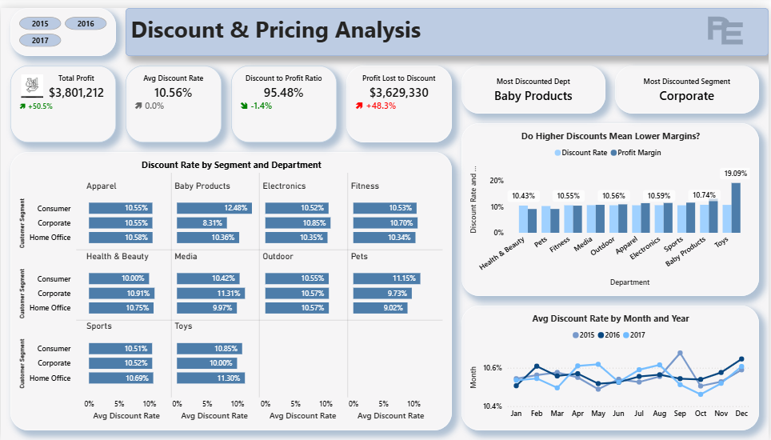
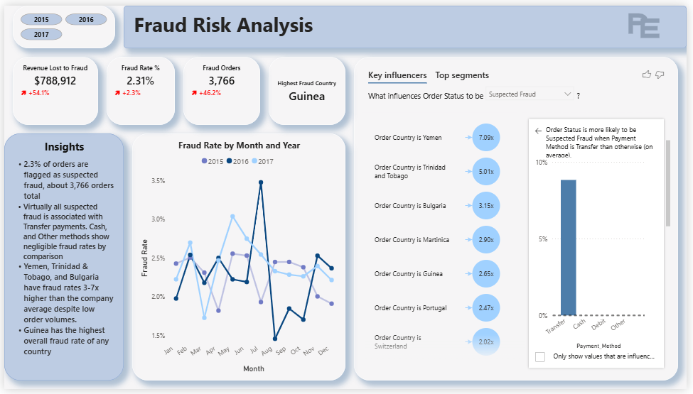

# supply-chain-analytics
Power BI dashboard analyzing 61,000+ Supply chain orders across DataCo (2015-2017). Covers sales performance, delivery operations, fraud detection and strategic recommendations.

## Project dataset
[Download Power BI File](https://drive.google.com/file/d/1OY0qGqWKcJtL6FzjESCFQ6BMX-1OtXFi/view?usp=drive_link)

---

# Sales, Logistics & Risk Performance Dashboard

## Project Overview

This project analyzes 61,468 supply chain orders from DataCo Global across 2015 to 2017. The goal was to uncover operational problems, revenue risks, and fraud patterns that were affecting profitability and customer trust.

**Tool Used:** Microsoft Power BI
**Dataset:** DataCo Supply Chain Dataset (Kaggle)
**Records Analyzed:** 61,468 orders
**Time Period:** 2015 to 2017 (2018 excluded, since it only had partial year data)
**Dashboard Pages:** 5 pages

---

## Business Questions Answered

- Are late deliveries affecting revenue and profit?
- Which departments and categories drive the most value?
- Where is fraud concentrated, and what does it cost the business?
- How do discounts affect profitability across departments and customer segments?
- What are the root causes of the operational issues, and what should be done about them?

---

## Key Findings

| Metric | Value | What this means |
|---|---|---|
| Total Sales (2015-2017) | $34.37M | Overall sales across the full period |
| Total Profit (2015-2017) | $3.80M | Overall profit across the full period |
| Profit Margin | 11.06% | Healthy, but discounting is eating into it |
| Late Delivery Rate | 55.97% | Over half of all orders arrive late |
| On-Time Delivery Rate | 48.39% | Less than half of orders ship on time |
| Revenue at Risk (Late Delivery) | $19.18M | Sales tied to orders that arrived late |
| Avg Discount Rate | 10.56% | Fairly consistent across departments |
| Discount to Profit Ratio | 95.48% | Discounts are nearly wiping out total profit |
| Profit Lost to Discount | $3.63M | Almost equal to total profit earned |
| Fraud Rate | 2.31% | About 1 in 43 orders is flagged as suspected fraud |
| Fraud Orders | 3,766 | Total number of suspected fraud orders |
| Revenue Lost to Fraud | $788,912 | Sales tied to suspected fraud orders |
| Total Orders | 61,468 | Full order count across 2015-2017 |

---

## Dashboard Pages

### Page 1 - Sales and Logistics Overview

A high-level snapshot of the business, with KPI cards for Total Profit, Total Sales, Late Delivery Rate, Profit Margin, and Total Orders. It also shows the top revenue-driving categories, a delivery status breakdown, customer segment revenue trends, and how sales, margin, and order volume compare across customer segments.

**Insights:**
- Revenue dropped to $11.2M in 2017, down from $11.6M, mainly because of fewer orders rather than lower prices.
- 56% of all orders arrive late, and this has stayed the same for three years in a row.
- The Consumer segment brings in the most revenue, the highest margin, and the most orders.
- Fishing is the top category, bringing in $6.8M in sales.

**Observation:** Delivery has been delayed for three years straight, and revenue is decreasing.

---

### Page 2 - Department Profitability

A department-level look at profitability, comparing each department's margin to the company average. It includes a decomposition tree that breaks down total profit by department and category, and shows how each department's share of profit has shifted over the three years.

**Insights:**
- Despite having below-average margins, Outdoor and Apparel still bring in the most revenue.
- Toys has the lowest sales but the highest margin (19%), making it a real missed opportunity.
- Health & Beauty and Pets are the only departments with margins nearly 2 points below the company average.

---

### Page 3 - Discount & Pricing Analysis

A breakdown of discount rates by customer segment and department, a comparison of discount rate against profit margin by department, and discount rate trends by month and year.

**Insights:**
- Discounts ate up 95.48% of total profit, meaning almost every dollar of profit was offset by a discount.
- Baby Products is the most discounted department, and Corporate is the most discounted customer segment.
- Toys has both the lowest average discount rate (10.0%) and the highest profit margin (19.09%), showing that discounting and profitability don't move together in any consistent way across departments.
- The average discount rate has stayed flat (10.4% to 10.6%) month to month, with no clear seasonal pattern.

---

### Page 4 - Delivery Performance

A look at late delivery rate by year and shipping mode, a comparison of late delivery rate by shipping mode and customer segment, total orders versus late delivery rate by month, and revenue at risk by shipping mode.

**Insights:**
- 56% of all orders arrive late, and this hasn't changed from 2015 to 2017.
- First Class shipping has a 97-98% late rate every single year, making it the worst performer despite being the most expensive option.
- Standard Class carries the highest revenue at risk ($8M), simply because of how many orders go through it, even though it actually has the lowest late rate (39%).

---

### Page 5 - Fraud Risk Analysis

Fraud rate trends by month and year, a Key Influencers analysis showing the strongest drivers of suspected fraud, and a breakdown of fraud rate by payment method.

**Insights:**
- 2.3% of orders are flagged as suspected fraud, about 3,766 orders in total.
- Almost all suspected fraud is tied to Transfer payments. Cash, Debit, and Other payment methods show very little fraud by comparison.
- Yemen, Trinidad and Tobago, and Bulgaria have fraud rates 3 to 7 times higher than the company average, despite having low order volumes.
- Guinea has the highest overall fraud rate of any country.

---

## Recommendations

### Logistics Failure

**Problem:** 56% of all orders are delivered late. First Class shipments have a 97% delay rate.

**Action:**
- Immediately review or replace the First Class shipping provider.
- Move high-priority orders to Standard or Same Day shipping.
- Audit logistics partners with the highest late delivery volume.

**Result:**
- Fewer late deliveries
- Recovered lost revenue
- Better customer satisfaction

---

### Revenue Decline

**Problem:** Orders declined, which brought revenue down from $11,589,112 to $11,192,354. Baby Products and Corporate get the highest discounts, but the overall discount rate stayed flat while revenue dropped, meaning discounting isn't what's driving sales.

**Action:**
- Focus on Toys, which has the highest profit margin (19%) but the lowest sales. A targeted marketing and inventory push here could boost profitability without needing more sales volume overall.
- Launch focused campaigns in high-performing categories like Fishing and Cleats.
- Re-engage inactive customers.
- Improve order fulfilment speed.
- Review discount levels for the Baby Products department and the Corporate segment.

**Result:**
- Higher order volume
- More stable revenue growth
- More repeat sales

---

### Fraud Concentration 

**Problem:** About 4,000 suspected fraud orders are concentrated in specific countries, and 100% of those orders were paid via Transfer.

**Action:**
- Enforce stronger fraud detection in high-risk areas.
- Add extra verification specifically for Transfer payments, since every fraud order used this method.
- Flag repeat suspicious buyers.

**Result:**
- Lower financial losses
- Better operating efficiency
- Protected revenue

---

## Data Preparation & Cleaning

The following steps were done before building the dashboard:

- Removed duplicate records
- Standardized date formats for accurate time-based calculations
- Created a Date Table for year and month calculations
- Grouped 40+ product categories into logical departments
- Validated delivery status values across all records
- Removed columns not needed for this analysis, including customer first name, last name, and email, to reduce noise and protect privacy
- Standardized text formatting by removing underscores, symbols, and special characters across multiple columns
- Converted ALL CAPS text values to Proper Case
- Excluded partial 2018 records so only complete years were analyzed
- Replaced abbreviated text values with their full spellings
- Replaced Spanish country and city names with their English spellings using a mapping table

---

## Tools & Skills Demonstrated

- **Power BI** - Data modeling, DAX, visualizations, decomposition trees, Key Influencers
- **Data Cleaning** - Handling nulls, duplicates, date formatting, and text standardization
- **DAX** - Time intelligence (DATEADD, SAMEPERIODLASTYEAR), CALCULATE, DIVIDE, SWITCH, and conditional formatting measures
- **Business Analysis** - KPI design, insight generation, and recommendation frameworks
- **Data Storytelling** - A multi-page dashboard that follows a problem, action, result structure

See [DAX_Measures.md](DAX_Measures.txt) for the full list of DAX measures used in this project.

---

## Connect With Me

- LinkedIn: [Your LinkedIn URL](https://www.linkedin.com/in/ekete-peace-a7837b275/)]
- Email: [peaceekete8@gmail.com]

  
## Dataset Source
DataCo Supply Chain Dataset — available on Kaggle  
[View Dataset](https://www.kaggle.com/datasets/shashwatwork/dataco-smart-supply-chain-for-big-data-analysis)

  
  
